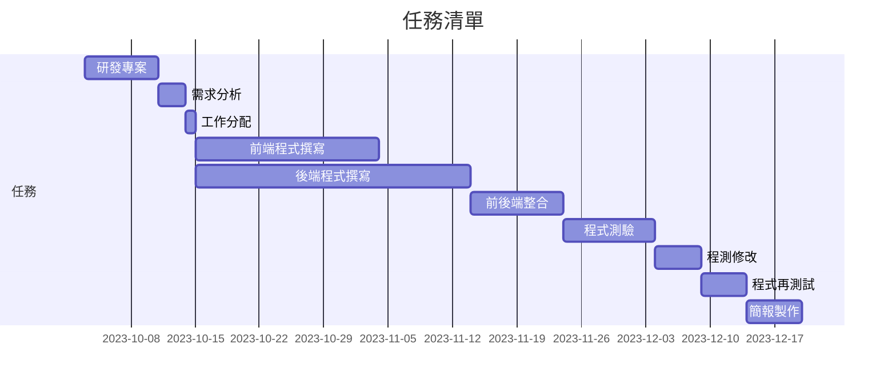

# C110118157-林柏誠
## C110118157
### C110118157
#### C110118157
##### C110118157

1. First order list item
2. Another item
    *  Unordered sub-list
3. Actual numbers don't matter, just that it's a number.
    1. Ordered sub-list
    2. 2nd sub-list
    3. 3rd sub-list
4. And another item
    + note 1
    - note 2
    * note 3
- [ ] todo list
- [ ] 2nd things
``` Python
s = " python syntax highlighting "
parint s
```
``` js
var s  = " JavaScript syntax highlighting "
alerat (s)
```
[](https://www.youtube.com/watch?v=StTqXEQ2l-Y "Everything Is AWESOME")

表格:
| Left-Aligned | Center Aligned | Right Aligned |
|:-------------|:---------------:|-----:|
| col 3 is     |some wordy text  |$1600 |
| col 2 is     |centered         |$12   |
| zebra stripes| are neat        |$1    |
|test |測試          |$3333 |
| Markdown     | Less            | Pretty |
| still        |rendres          |nicely|
|1             |2                |3     |
## 甘特圖
### Mermaid

